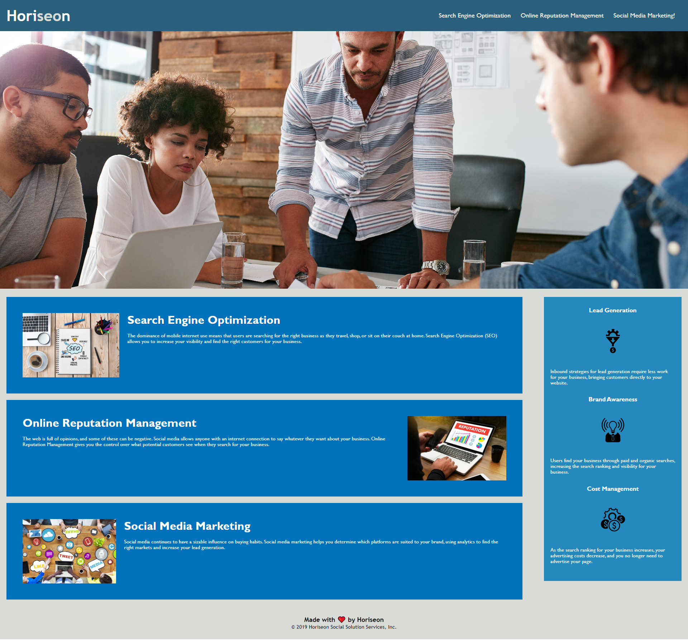

# 01 HTML CSS Git: Code Refactor

## Description

A project to refactor an existing website to make it more accessible, so the clients SEO performance is increased and the webpage is more accessible.
Title tags added to CSS images, alt tags added to HTML images and icons, semantic HTML elements identified, headers are sequential and titles are descriptive.
The project removed ~60 lines of CSS code by consolidating duplications.

## Usage

The website is identical in appearance to the original webpage, with all the changes taking place in the code only.

The following image shows the web application's appearance and functionality:

> **Note**: This layout is designed for desktop viewing, so you may notice that some of the elements don't look like the mock-up at a resolution smaller than 768px.

## Installation

N/A 

## Credits

Original source code property of edX x Skills for Life.

---
© 2022 edX Boot Camps LLC. Confidential and Proprietary. All Rights Reserved.
